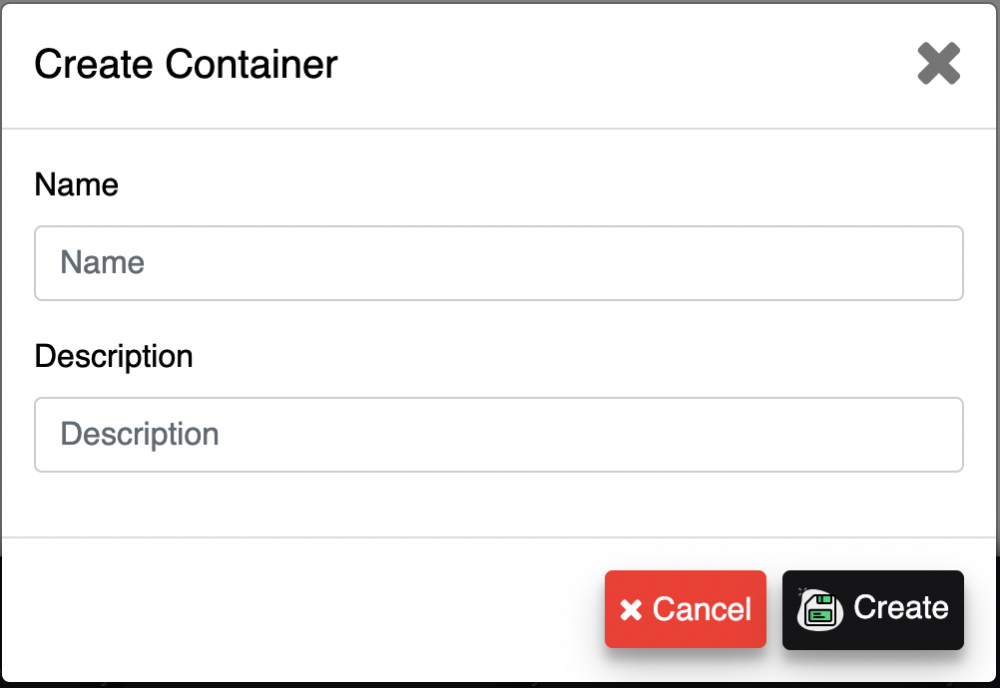

export const Highlight = ({children, color}) => ( {children} );

The containers page is for managing your container assets that you service to your customers. This is how the system tracks data between containers and allows for deeper insights into meta data individualized between your containers.

The containers page breaks containers down into three sections.

  - **Past Due:** Is the containers that are currently at a customer's location past their designated pickup date.
  - **Due in:** Is the containers that are currently at a customer's location within their designated pickup date.
  - **Not Working:** Is the containers that aren't currently at a customer's location and aren't in service.

---

### Creating a Container

To create a new container, you first need to select on the create container button to open the Create Container Form. 

##### Create Container Button

  

With the Create Container Form opened, enter your containers information and select save once all of your containers information is entered to add your container to the system.

##### Create Container Form

---

### Removing a Container

To remove a container, you first need to select on the remove container button to open the Removing Container Form. 

##### Remove Container Button

  

With the Remove Container Form opened, select your container from the Container dropdown list and select delete to remove your container from the system. You also have the option of removing your container's history from your account or not. If you remove your container's history from your account it's history won't be factored in when the system delivers historical based data.

:::note
Once a Container is deleted, this action can't be <Highlight color="#25c2a0">**UNDONE**</Highlight> and the system will no longer process transactions for the deleted container.
:::

##### Remove Container Form

---
