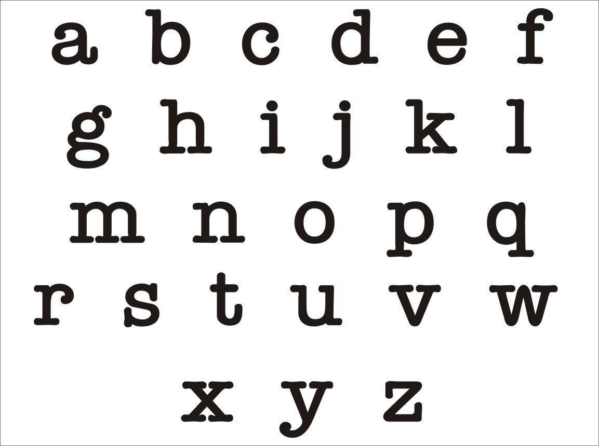
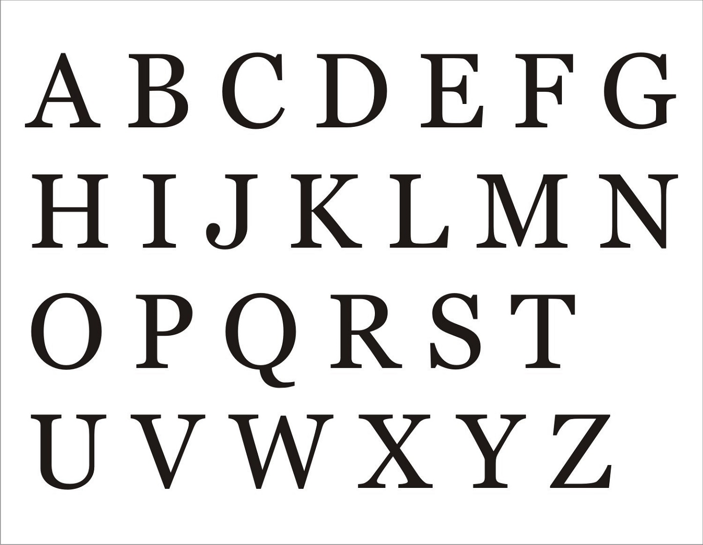

export const Highlight = ({children, color}) => ( {children} );

Password Standards are a set of guild lines that helps in preventing attacks, breeches, loss of data, and unauthorized account access. Our password standards require created passwords on the platform to follow six different rule sets. 

:::important
Created passwords are not allowed to contain quotation marks or whitespaces and are required to contain at least one lowercase, uppercase, numeric, and special character.
:::

### Quotations:

Quotations, also known as quotation marks, are punctuation marks used in paris in various writing systems to set off direct speech. 

### Whitespaces:

Whitespaces are the horizontal spacing between words and are commonly entered on a computer with the spacebar.

### Lowercase Characters:

Lowercase characters also known as minuscule characters, are smaller sized characters and have a parallel set of lager sized characters. Lowercase characters are generally used for the letters in all words except for the beginning of a sentence or proper nouns.

### Uppercase Characters:

Uppercase characters also known as capital characters, are larger sized characters and have a parallel set of smaller sized characters. Uppercase characters usually signify the beginning of a sentence or a proper noun.

### Numeric Characters:

Numeric characters are characters that are a number (0 - 9).

### Special Characters:

Special characters are characters that are not a lowercase, uppercase, or numeric character. Supported special characters include.

|Name|Character|
|----|---------|
|At Sign|@|
|Percent Sign|%|
|Plus Sign|+|
|Slash|/|
|Exclamation Point|!|
|Number Sign|#|
|Dollar Sign|$|
|Caret|^|
|Question Mark|?|
|Colon|:|
|Comma|,|
|Left Parenthesis|(|
|Right Parenthesis|)|
|Left Brace|{|
|Right Brace|}|
|Left Bracket|[|
|Right Bracket|]|
|Tilde|~|
|Hyphen|-|
|Underscore|_|
|Asterisk|*|
|Ampersand|&|
